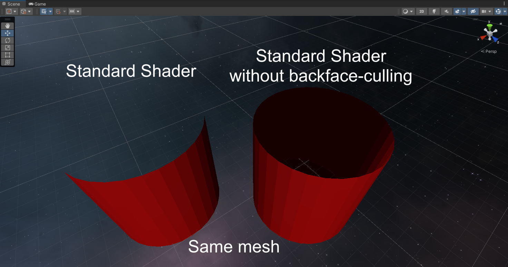

# Unity Shader without backface-culling
 A Standard Unity shader with backface-culling turned OFF. If you want to keep the polycount low, but still want to see the inside of a tea pot.
 Also good for clothes!
 The code is not mine! I just found it on some forums... Decided put it up here for future use or if someone needs it.
 
